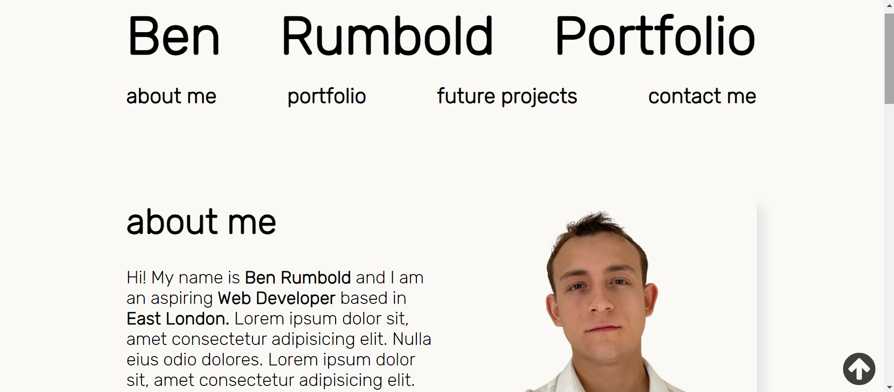

# Ben Rumbold Portfolio

## Description

Professional web devlopment portfolio to showcase my work, featuring:
- Navigation bar with links to corresponding sections of the page.
- 'About me' section with bio about my self and picture. 
- 'Portfolio' section of 5 cards of my best work with picture, header and description, with the first card being twice the size of the other 4
- 'Future Projects' section of 5 cards of ideas of future work to come with picture, header and description, with the first card being twice the size of the other 4
- 'Contact Me' section with logos of Facebook, LinkedIn, GitHub, Twitter. Linked phone number and email are also apparent.

## Table of Contents (Optional)

- [Installation](#installation)
- [Usage](#usage)
- [Credits](#credits)
- [License](#license)

## Installation

N/A

## Usage

    

## Credits

Inspiration for code for 'scroll to top button': https://www.w3schools.com/howto/howto_js_scroll_to_top.asp

Inspiration for code for 'scroll into view' feature: https://developer.mozilla.org/en-US/docs/Web/API/Element/scrollIntoView

Credits for Logos: https://www.onlinewebfonts.com/icon

Credits for Font: (License for Rubik font): 
Copyright 2015 The Rubik Project Authors (https://github.com/googlefonts/rubik)

This Font Software is licensed under the SIL Open Font License, Version 1.1.
This license is copied below, and is also available with a FAQ at:
http://scripts.sil.org/OFL

SIL OPEN FONT LICENSE Version 1.1 - 26 February 2007

## License

MIT License

Copyright (c) 2023 Ben Rumbold

Permission is hereby granted, free of charge, to any person obtaining a copy
of this software and associated documentation files (the "Software"), to deal
in the Software without restriction, including without limitation the rights
to use, copy, modify, merge, publish, distribute, sublicense, and/or sell
copies of the Software, and to permit persons to whom the Software is
furnished to do so, subject to the following conditions:

The above copyright notice and this permission notice shall be included in all
copies or substantial portions of the Software.

THE SOFTWARE IS PROVIDED "AS IS", WITHOUT WARRANTY OF ANY KIND, EXPRESS OR
IMPLIED, INCLUDING BUT NOT LIMITED TO THE WARRANTIES OF MERCHANTABILITY,
FITNESS FOR A PARTICULAR PURPOSE AND NONINFRINGEMENT. IN NO EVENT SHALL THE
AUTHORS OR COPYRIGHT HOLDERS BE LIABLE FOR ANY CLAIM, DAMAGES OR OTHER
LIABILITY, WHETHER IN AN ACTION OF CONTRACT, TORT OR OTHERWISE, ARISING FROM,
OUT OF OR IN CONNECTION WITH THE SOFTWARE OR THE USE OR OTHER DEALINGS IN THE
SOFTWARE.

## Badges

## Features

- Navbar with links to corresponding sections of webpage
- Cards of both work and future projects with link to corresponding webpage (if applicable)
- 'Coming soon' page for not yet completed work examples, with button that redirects users back to the portfolio
- 'Back to top Button' fixed to bottom of screen

## How to Contribute

https://www.contributor-covenant.org/version/2/1/code_of_conduct/code_of_conduct.md

## Tests

N/A

